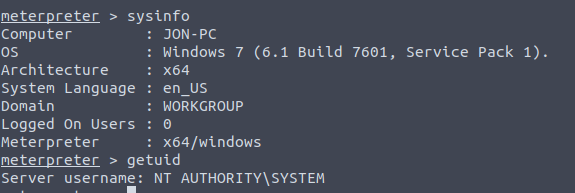
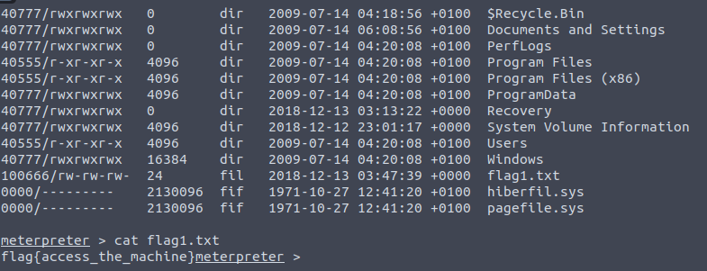
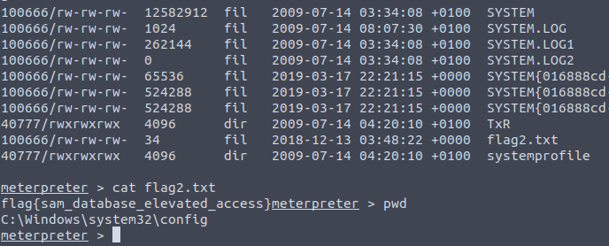
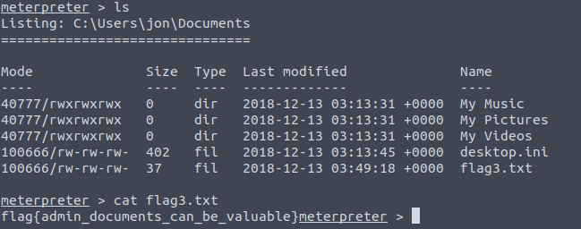

In this writeup I will be solving [Blue.](https://tryhackme.com/room/blue)

### CTF Theme

The main objective of this room is to get access to the Windows machine which has multiple vulnerabilites.\
But this room is mainly focussed on ms17-010 exploit popularly known as eternal blue which deals with bug in SMB server of Windows machine.

---

### Recon

Scan the machine
  
  nmap -sV -vv --script vuln machine-ip 

How many ports are open with a port number under 1000?

  After you execute that above command you'll find __3__ open ports (under 1000) 

What is this machine vulnerable to? (Answer in the form of: ms??-???, ex: ms08-067)

  Under nmap results you will discover that it is vulnerable to two scripts. 
  But keeping eternal blue in mind we will go further with the one having SMB exploit (__ms17-010__). 

---

### Gain Access

Find the exploitation code we will run against the machine. What is the full path of the code? (Ex: exploit/........)
  
  Start metasploit and search for ms17-010. You will get the full path of the exploit which is exploit/windows/smb/ms17_010_eternalblue 

Show options and set the one required value. What is the name of this value? (All caps for submission)

  After performing show options check for required field values (RHOSTS) 

---

### Escalate

If you haven't already, background the previously gained shell (CTRL + Z). Research online how to convert a shell to meterpreter shell in metasploit. What is the name of the post module we will use? (Exact path, similar to the exploit we previously selected)
  
 post/multi/manage/shell_to_meterpreter

Select this (use MODULE_PATH). Show options, what option are we required to change?

 session

---

### Cracking

  
Within our elevated meterpreter shell, run the command 'hashdump'. This will dump all of the passwords on the machine as long as we have the correct privileges to do so. What is the name of the non-default user?

    
   Jon

  
Copy this password hash to a file and research how to crack it. What is the cracked password?

    
   alqfna22

---

### Find flags!

  
Flag1? This flag can be found at the system root.

    
   flag{access_the_machine}

  
Flag2? This flag can be found at the location where passwords are stored within Windows.
<!--Storage path C:\Windows\System32\Config-->
    
   flag{sam_database_elevated_access}

  
flag3? This flag can be found in an excellent location to loot. After all, Administrators usually have pretty interesting things saved.

    
   flag{admin_documents_can_be_valuable}

---

`You can connect me through the below platforms for my further updates`